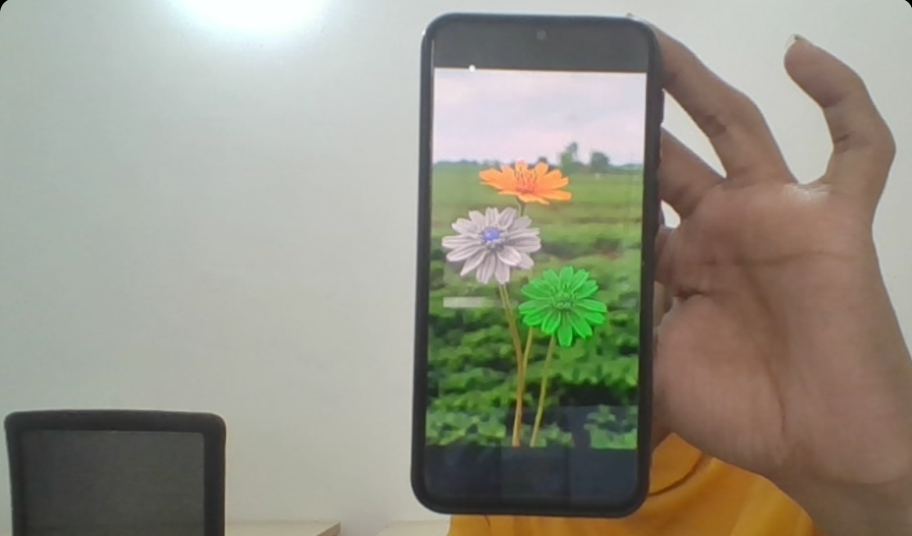

  
  
  
  
  
  
  
  
   
  
  
  
  
  
  
  
  

<h3 align="center">
  𝓘'𝓶 𝓪 𝔻𝕖𝕧𝕖𝕝𝕠𝕡𝕖𝕣, 𝕻𝖗𝖔𝖌𝖗𝖆𝖒𝖒𝖊𝖗 ＆ $Coder$ !!
</h3>
<h5 align="center">
  <a href="https://chat.whatsapp.com/G9TIwwUGatDGkY1QquVpiH">
    ⚘
  </a>
  I’m currently
  <a href="https://github.com/ShivaShirsath?tab=repositories">learning</a>
  everything
  <a href="https://t.me/OnAndroid">
    ... 😇
  </a>
</h5>
<table border="1">
  <tr>
    <th align="right">Languages</th>
    <!-- Programming Languages -->
    <td>
      
      
      
      
      
      
      
      
      <!-- Scripting Languages -->
      
    </td>
  </tr>
  <tr>
    <th align="right">Tools</th>
    <td>
      
      
      
      
      
      
      
      
      
      
    </td>
  </tr>
  <tr>
    <th align="right">Databases</th>
    <td valign="top">
      
      
      
    </td>
  </tr>
</table>
<picture>
  <source media="(prefers-color-scheme: dark)"
    srcset="https://shivashirsath.github.io/ShivaShirsath/github-snake-dark.svg"/>
  <source media="(prefers-color-scheme: light)"
    srcset="https://shivashirsath.github.io/ShivaShirsath/github-snake.svg"/>
  
</picture>
<picture>
  <source width="100%"
    srcset="https://github-readme-stats.vercel.app/api?username=ShivaShirsath&show_icons=true&icon_color=F80&text_color=FFF&hide_title=true&border_color=426&include_all_commits=true&bg_color=000&title_color=080&border_radius=25"
    media="(prefers-color-scheme: dark)"/>
  <source width="100%"
    srcset="https://github-readme-stats.vercel.app/api?username=ShivaShirsath&show_icons=true&icon_color=F80&text_color=000&hide_title=true&border_color=426&include_all_commits=true&bg_color=fff&title_color=080&border_radius=25"
    media="(prefers-color-scheme: light), (prefers-color-scheme: no-preference)"/>
  
</picture>